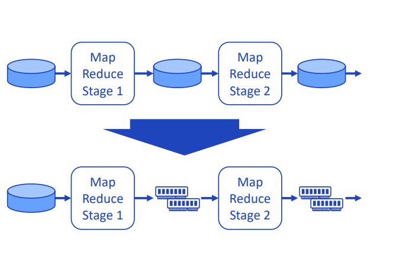

#### **Apach Spark역사와 개념**

- `2019-2010` `Matei Zahariz`의 UC Berkly의 AMP Lab에서`2009`년 개발 그리고 `2010` BSD License로 공개
- `BSD License` : **BSD 라이센스(Berkeley Software Distribution License)**는 소프트웨어의 소스 코드를 수정하고 배포할 수 있는 권한을 제공하는 자유 소프트웨어 라이센스 중 하나입니다. 이 라이센스는 원래 1980년대 후반과 1990년대 초반, 유닉스 기반 운영 체제인 **BSD(Unix의 한 변형)**의 소프트웨어 배포를 위해 사용되었습니다. BSD 라이센스는 그 간결함과 자유로운 사용, 수정 및 배포 권한 덕분에 매우 널리 사용됩니다.
- `2013` 프로젝트는 Apache재단에 기부가되었고 `Apache2.0`라이센스로 변경
- `2014` Top-level Apache project가됨
- `2014` M.Zahariz(Spark개발)는 `Databrics`회사를 창립
- 대규모 데이터 처리용 통하분석 엔진`unified analytics engine for large-scale data processing`
- 일반적인 목적
  - interactive processing
  - Extremly fast batch processing
  - Real time stream proceessing
  - Distributed machine learning modeling and inference engine
- `in-memory` 분산 컴퓨팅 엔진

#### **Why is Apache Spark popular?**

- `Hadoop Ecosystem`의 차세대 `processing engine`
- 아래와같 task에 사용
  - ETL and Data Cleansing
  - SQL batch job (대규모 데이터셋)
  - sesoors,IoT,금융시스템으로부터 `Processing streaming data`
  - Machine leanring 그리고 inferece(추론)

#### **The Problem with Map Reduce**

- MR작업은 여러 cycle의 `Map그리고 Reduce`로 구성
- 각각의 `MAP`은 HDFS로부터 읽고 local disk로 쓰기가 필요
- 각각의 `Reduce`작업은 local disk로부터 읽고 HDFS로 쓰기가 필요
- `Disk I/O`연산은 매우 비싼 연산
  
#### **Evolving Hardware : Cost and Performance**

- `2007` Hadoop 0.14.1 소개
  - `HDFS`와 `MapReduce`는 disk기반의 storage에 매우 의존적
- `2013` Apache Spark 0.7.0 소개
  - `memory`비용을 거의 `1/50`로 줄임
- `2016` Apache Kudu1.0소개 SSD Storage에 최적화됨

#### **In-memory Distributed Computation**

- `disk I/O`비용은 최초의 데이터를 memory로 올릴떄만 필요
- `computation cycle`동안 storeage 기반의 `memory`를 사용
- `MapReduce`에 비해 일반적 100+times 빠름



#### **Spark Driver and Executors**

- Apache Spark는 `master-slave` 아키텍처를 가짐
- `Driver Program`은 `master`와 같이 행동하고 Executor를 생성 및 삭제등 coordinator 역할을 함
- `Driver`는 데이터를 파티션화시키고 각각의 `partition`을 Executor에게 전달하여 `병렬 분산 처리`
- 개별 `Executor`는 실제 `computing`을 함
- 개별 `Executor`는 결과를 `Driver`에게 다시 전달
  


#### **Spark Driver Node**

- Spark cluster를 `orchestrate`하는역할 
- driver는 `DAG(Directed Acycli Graph) Scheduler`,`task scheduler`, `backend scheduler`정리
- 이 driver의 component들은 `user code`를 cluster에서 실행시킬 spark job으로 변환하는 역할을 함
- `dirver 노드`내에 숨겨진 클러스터 관리자는 Spark 클러스터에서 리소스를 획득하고 Spark 작업에 할당하는 역할을 합니다. 이러한 리소스는 워커 노드 형태로 제공됩니다 .


1. 드라이버 노드는 다른 머신과 마찬가지로 CPU, 메모리, DISK 및 캐시와 같은 하드웨어가 있지만 이러한 하드웨어 구성 요소는 Spark 프로그램을 호스팅하고 더 넓은 클러스터를 관리하는 데 사용됩니다. 드라이버는 사용자와 클러스터에 제출된 모든 작업을 완료하는 데 필요한 물리적 컴퓨팅 간의 링크입니다.
2. Spark는 Scala로 작성되었으므로 클러스터 내의 모든 머신에는 JVM(Java 가상 머신)이 실행 중이어야 하며, Spark가 호스트의 하드웨어와 작동할 수 있어야 합니다.
3. Spark 프로그램은 이 JVM 내부에서 실행되며 사용자가 Spark 클러스터에 액세스하는 지점인 SparkContext를 생성하는 데 사용됩니다.

#### **Spark Worker Node**


1. `worker node` 일반적으로 CPU, 메모리, 디스크, 캐시와 같은 다른 하드웨어를 갖춘 독립형 머신입니다.
2. `driver` 마찬가지로 Spark가 `worker node`에서 실행되려면 코드를 올바르고 의미 있는 방식으로 해석할 수 있도록 시스템에 호환되는 Java 버전이 설치되어 있어야 합니다.
3. `worker node`에 Spark를 설치하면 `driver node`는  클러스터 관리 기능을 활용하여 작업자에서 사용 가능한 하드웨어를 매핑할 수 있습니다.
클러스터 관리자는 기본적으로 장치에서 사용 가능한 코어 수인 `slot` 수를 추적합니다 .이러한 `slot`은 사용 가능한 컴퓨팅 청크로 분류되며 드라이버 노드에서 완료할 작업을 제공할 수 있습니다.
저장 메모리와 작업 메모리의 두 섹션으로 나뉜 사용 가능한 메모리 양이 있습니다.이 비율의 기본 비율은 50:50이지만 Spark 구성에서 변경할 수 있습니다.
각 작업자에는 여러 개의 디스크도 연결되어 있습니다.하지만 Spark는 디스크가 아닌 메모리에서 작동한다고 말할 것입니다!그러나 Spark는 여전히 셔플 파티션을 할당하기 위한 디스크가 필요하고(이 문서의 뒷부분에서 자세히 설명) 디스크에 대한 지속성과 디스크로의 스필을 위한 공간도 필요합니다.

#### **Spark Runtime architecture**

- `Spark Runtime Architecture`는 말그대로 코드가 실행되는 순간에 cluster에서 일어나는일
- `eager`와 `lazy` evaluation이 모두 존재 
- `Spark의 action` = `eager`
- `Spark의 transformatioin` = `lazy`
- `Transformation`은 말그대로 `lazy`. 우리가 데이터에 어떤 `operation`을 호출할떄 즉시 실행하지 않음
- `Spark`은 어떤 연산이 호출되는지에 대한 기록을 유지 (join,filter포함)
- `Action`은 `eager`. 호출이 되면 cluster는 바로 코드 줄이 실행 되자마자 예상결과를 계산. 실행되면 `non-RDD`구성요소 생성
  
#### **Types of Transformation**

- `narrow`그리고 `wide`변환 존재. Spark가 데이터를 관리하고 분산방식으로 계산하는 방식을 이해하는 중요한 유형 
- `Transformation`은 서로RDD를 생성


- `Narrow Transformation`은 하나의 입력 파티션이 하나의 출력 파티션을 생성하도록 정의 --> `filter`
  - 다른 작업자 노드에 보관된 데이터를 이해할 필요 없이 더 작은 데이터 세트로 필터링 할 수 있는 데이터 프레임을 가질 수 있기 때문
- `Wide Transformation`은 worker node가 필요한 작업을 완료하기 위해 네트워크를 통해 데이터를 `전송(shuffle)`해야한다는 사실에 정의-->`join`
  - 두 데이터 세트의 조인을 완전하고 올바르게 완료하기 위해서 클러스터 전체에서 데이터를 수집해야함
  


- 여러 형태를 가질 수 있으며, `n input partitions`이 반드시 `n output partitions`이 되는게 아님
- 가령의 위이 `join`은 2개의 RDD를 활용하여 새로운 RDD를 생성

#### **Runtime**
- 사용자가 선호하는 방법을 통해 drive에 코드를 제출하면 드라이버는 transformatioin(`filters,joins,groupby,unions`) 그리고 actions(`counts,writes`)을
포함하는 코드를 해결되지 않은 논리적계획으로 암묵적으로 변환
- `catalyst optimiser` : submission stage에서 logical plan catalog를 참조하여 모든 코드가 필요한 parameter를 준수하는지 확인하고, 이것이 완료되면 해결되지 않은 논리적 계획이 논리적 계획으로 변환
- 이 프로세스는 `optimisation(like planning tranformation and actions)` 이 `optimiser`는 `catalsy optimiser`라고 일컫음

```
Spark SQL의 핵심은 `Catalyst Optimizer`로 고급 프로그래밍 언어 기능을 새로운 방식으로 활용하여 확장 가능한 쿼리 최적화 프로그램을 구축
Catalyst는 Scala의 functional programming 기반으로 2가지 주요목적을 위해 설계

1. Spark SQL에 새로운 최적화 기술과 기능을 쉽게 추가 
2. 외부 개발자가 최적화 프로그램을 확장 할 수 있또록 (데이터 소스별 규칙추가, 새로운 데이터 유형 지원)
```
- <https://www.databricks.com/glossary/catalyst-optimizer>
  
  

- opmisations이 완료되면 `logcial paln`은 `multiple physical execution plan`으로 변환하고, 이 plan들은 각 plan들을 분석하여 `cost model`로 분류되고 각 `execution plan`실행하기 윟 비용값을 적용
- lowest cost의 plan이 최종 출력으로 선택. 이 선택된 `execution plan`은 여러단게의 `job`이 포함


- stage에서는 cluster로 전송되도록 묶인 작은 물리적 호출  `task`이 존재
- 이러한 `task`가 배포되기전에 driver는 cluster관리자와 통신하여 리소스를 `협상(negotiate)`


- 이것이 완료되고 리소스가 할당되면 작업은 자유 시간이 있는 작업자 노드(실행자)에 분산되고 드라이버 프로그램은 진행 상황을 모니터링합니다.이것은 현재 사용 가능한 리소스와 클러스터 구조를 염두에 두고 가능한 가장 효율적인 방식으로 수행됩니다.위의 예에서는 간단합니다.세 개의 작업자 노드에 분산할 세 개의 작업이 있습니다.작업은 위의 방식, 즉 각 작업자 노드에 하나의 작업을 분산하거나 Spark의 병렬 특성으로 인해 하나의 노드로 전송되어 여전히 비동기적으로 실행될 수 있습니다.그러나 사용 가능한 컴퓨팅 슬롯보다 많은 작업이 있거나 클러스터의 노드와 비교하여 균일하게 나눌 수 없는 작업 수가 있는 경우 복잡성이 발생합니다.다행히도 Spark가 이를 직접 처리하고 작업 분산을 관리합니다.
- 언급할 가치가 있는데, Spark는 작업을 효율적으로 분배할 수 있지만 항상 데이터를 해석할 수는 없습니다. 즉, 작업 기간에 큰 시간 차이를 일으킬 수 있는 데이터 왜곡`(skew)`이 발생할 수 있습니다. 그러나 이는 모두 기본 데이터 레이크가 어떻게 구조화되어 있는지에 따라 달라집니다.`Delta Engine(Photon)`을 사용하여 빌드하는 경우 쿼리 실행에 대한 라이브 개선과 더 나은 셔플 크기와 최적의 조인 유형을 장려하는 개선을 활용할 수 있습니다.
####  **SparkContext Entry Point Object**

- `SparkContext` 객체는 Spark 함수의 주요 진입점
- 그것은 `Spark Cluster`의 connection을 나타냄
- Driver Program은 `SparkContext`를 활용해 clutser와 resource manager와 commnuicate하여 `coordinate`그리고 `execute` job


#### **RDD(Resilient Distributed Datasets)**

- RDD란 Spark에서 기본 데이터구조
- Spark와 Core API에서 주요 추상화된 데이터 
- RDD는 `fault-tolerant immutable distributed collections of ojbect`
  
#### **RDD: Most Common Use Case**
- pre-prcoess  `unstructured/semi-structured data` 그리고 `structured data`로 covert
  - `Spark SQL, Hive or Impala`로 Query가능 

#### **RDD 만드는법**

1. 파일에서 읽기 
  - storage(local file system,.hdfs,Cloud Storage)
  - core api는 parquet를 바로 읽지는 않음 why? parquet는 구조화된 데이터 보통 text,json,csv에서 읽음
2. SparkContext의 method `parallelize` method
  
```python
 my_collection = [1, 2, 3, 4 ]
 parallel_collection = sc.parallelize(my_collection)
 parallel_collection.take(2
``` 
3. RDD를 transformation 하여 생성 
   
#### **RDD 만드는법**  
- `unstructured or semi structured dataset` --> `Core API`로 읽음
- `structured dataset` --> `Dataframe API`로 읽음
  - schema정보를 포함하는  binary file (parquet,orc)
  - table로부터 data읽음(hive,hbase,cassandra)
- usecase에 따라서 `Core API' 또는 `Dataframe API`로 읽음
  - json,xml,csv

#### **RDD Operation**
- 2가지 type의 operation을 지원
  - Transformation  (from existing one to a new dataset)
  - Action return a value to the Drive Program 
- Operation Example
  - `map` : transformation (각각의 datset에 function을 넘겨 새로운 RDD결과를 만듬)
  - `reduce` : aggreagate (RDD의 모든 요소를 어떤 function을 활용해서 취합)
- `Lazy Transformation`
  - 모든 Spark Transformation은 lazy transformation
- `Immutable Transformations`

### **참고**

- <https://medium.com/nerd-for-tech/apache-spark-multi-part-series-what-is-apache-spark-63c3f6caa3c>
- <https://towardsdatascience.com/apache-spark-multi-part-series-spark-architecture-461d81e24010>