---
title: "(1) Getting Started with Google Kubernetes Engine"
date : 2025-01-13 09:00:00 +0900
categories: [Kubernetes,GKE]
tags : [gcp,wif]
---

### **Introduction to Containers and Kubernetes**

####  **Hypervisor** 
기본 하드웨어의 운영체제의 종속 항목을 타파하고 여러 가상머신에서 하드웨어를 공유할 수 있게 해주는 소프트웨어 레이어를 `하이퍼바이저`라고함 ex) KVM(커널 기반 가상머신)

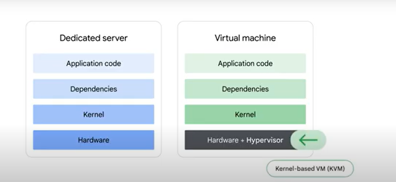

- 가상화를 통해 새 서버를 상당히 빠르게 배포가능. 가상머신을 이미지호 하여 배포
- 리소스 낭비가 줄고 이동성이 향상
    

#### **한계** 
- 애플리케이션과 종속 항목(dependency) 운영체제로 여전히 묶여있음. VM을 다른 하이퍼바이저 제품으로 이전하는 것은 쉽지 않음
- 또한 단일 VM내에서 여러 애플리케이션을 실행하면 또 다른 문제가 발생
- 동일 종속항목 애플리케이션이 격리되지 않으며 한쪽이 리소스를 많이 사용하면 다른 애플리케이션에 영향을 줌
- 한쪽이 dependency를 업그레이드 하면 다른 애플리케이션이 멈출수도 있음
  
    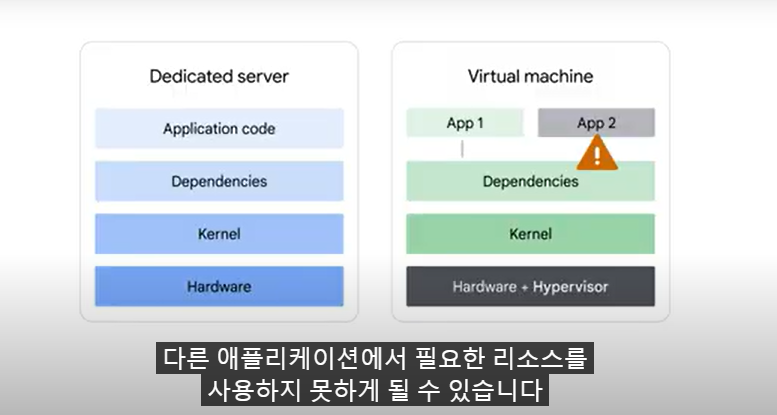
    
#### **Container**
위의 하이퍼바이저의 한계를 극복하고 커널이나 운영체제는 가상화할 필요 없이 사용자 공간(커널위의 모든 코드로 애플리케이션,dependency를 포함) 추상화를 구현한 것이 `Container`이다. 
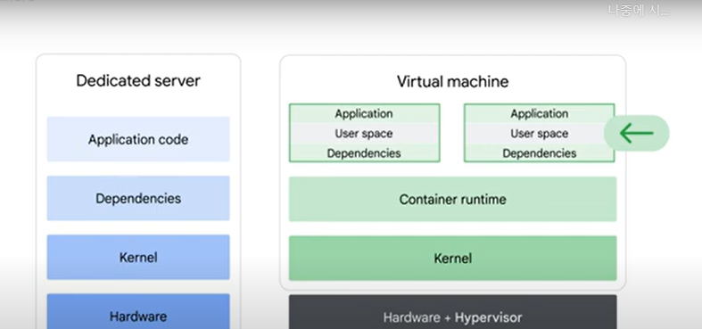

- 애플리케이션 코드 실행을 위해 격리된 사용자 공간
- container가 가벼운 이유는 운영체제 전체를 포함하지 않기때문이다. 
- 기본 시스템에 예약하거나 긴밀하게 통합할 수 있어 효율적
- OS의 프로세스만 시작하고 중지하며 애플리케이션마다 VM전체를 부팅 할 필요가 없음
- 코드는 코드에 피룡한 모든 depedency와 함께 패키징 되며 container를 실행하는 엔진은 `runtime`에서 dependency를 사용할 수 있게 만드는 역할
  
- 확장 가능한 고성능 애플리케이션을 제공하는 코드 중심적인 방식
- container는 안정적인 hw와 sw에대한 엑세스를 제공
- linux 커널을 기반으로 하기때문에 코드가 local 또는 production에 잘 수행 
- 마이크로 서비스 설계 패턴, 즉 세분화되고 느슨하게 결합된 구성요소르 사용하여 쉽게 애플리케이션 빌드 가능

#### **Container Images**
- Container는 단순히 `image의 실행중인 instance일뿐`
- Container image에 sw를 build함으로써 개발자는 애플리케이션을 실행할 시스템에 대해 걱정하지 않고 애플리케이션을 패키징하여 제공 가능
- 하지만 Container image를 build하고 실행하려면 SW가 필요 ex) Docker는 image를 build하고 실행할 수 있지만 k8s와 같이 대규모 `application Orchestrate가 불가능 `
- Container는 작업 부하를 분리하는 기능을 가지고 있음. 아래와 같은 Linux 기술로 구현
  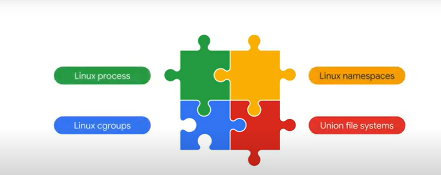
    1. linux process :  다른 모든 프로세스와 별도로 자체 가상메모리 주소공간을 가지고 있음
    2. linux namespaces : 프로세스id, 디렉터리 트리, ip주소등 애플리케이션이 볼 수 있는 내용을 제어. k8s namespace와 다름
    3. linux cgroups : cpu, 시간, memory, i/o 대역폭 및 기타 리소스 최대 소비량등 애플리케이션이 사용할 수 있는 것을 제어
    4. union file systems : 필요한 모든것을 패키지로 묶음
- **Container manifest**

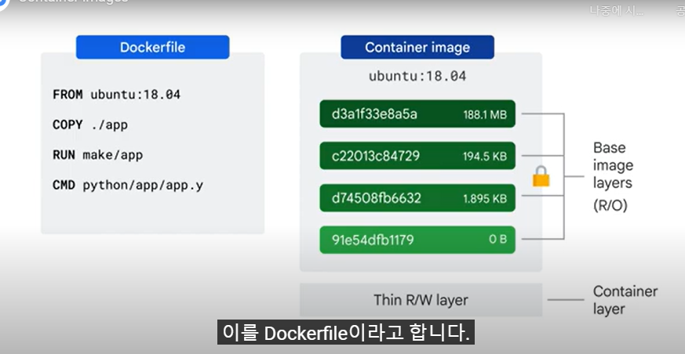

- dockerfile는 내부의 레이어를 지정. 읽기 전용이지만, 실행되면 쓰기 가능한 임시 최상위 레이어도 가지게됨
- 쓰기가능한 레이어는 일시적이므로 다른곳에 저장되어야함 
- 레이어마다 차이점만 해당 레이어에 저장 (전체 이미지 복사하는 대신)
- Google은 `Cloud Build`를 통하여 container를 제공(컨테이너 빌드관리)
- 해당 이미지를 GKE,APP Engine,Cloud Run등에 배포

#### **Kubernetes**
- container화된 workload와 서비스를 관리하는 오픈소스 플랫폼
- declarative configuration을 지향. 불필요한 작업을 없애줌 

#### **지원하는 workload 유형**
- **Stateless Application** : Nginx,Apache web server
  - **무상태** : 클라이언트나 이전 요청의 데이터를 기억하지 않음
  - **독립성** : 각 요청은 독립적이며 클라이언트가 상태 공유가 없음
  - **확장가능** : 무상태이므로 쉽게 확장 가능
  - Deployment를 사용, ReplicaSet을 통해 다수의 pod를 쉽게 스케일링
  - 예시
    - web : nginx,apache web
    - RESTful API서비스
    - 데이터 처리 작업
- **Stateful Application** : 사용자/세션 데이터를 영구 저장할수있음
  - **상태 유지** : 특정 클라이언트 또는 프로세스와 연관된 데이터를 유지
  - **데이터 의존성** : 이전 욫어의 데이터를 기반으로 후속 요청을 처리
  - **고유성** : 인스턴스는 고유하며 특정 데이터를 처리하거나, 특정 저장소에 연결
  - PV(Persistent Volume)을 사용하여 스토리지와 데이터를 지속적으로 유지
  - 예시
    - db: mysql,postgresql
    - messaging system : kafka,rabbitmq
    - 파일 저장 서비스
- autosclae containerized apps
- 사용자는 workload의 리소스 요청 수준과 한도를 지정가능
- 풍부한 플러그인과 부가기능 ecosystem으로 확장 가능

#####  **Airflow** : Stateful와 Stateless특성을 모두 가진 하이브리드 애플리케이션
  - **Stateful** : scheduler,database,log storage 상태 데이터(task,workflow정의)를 유지해야 하므로 `stateful`
  - **Stateless** : webserver,worker등 데이터를 외부 db나 스토리지에 의존하므로 stateless로 구현

#### **GKE(Google Kubernetes Engine)**
- Google 인프라에서 호스팅되는 관리형 k8s서비스. 배포 및 관리 확장하는데 도움이 되도록 설계
- GKE엔진은 노드,확장, 보안 및 기타 사전구성된 설정과 같은 클러스터 구성을 관리하도록 설계된 GKE Autopilot이라는 운영모드를 제공

### **Kubernetes Architecture**

#### **Kubernetes Concept**
2가지 개념을 알아야함

1. Kubernetes Object model
   - k8s에서 관리하는 각각의 대상은 object로 표시
   - 사용자는 object 속성과 상태를 보고 변경 가능
2. Declarative management
   - object를 관리하는 방법은 지시 받아야함
   - 이는 지시한 상태를 달성하고 유지되도록 작송
   - `watch loop`를  통해 작동

- **k8s object의 2가지 주요 요소**
  - **object spec** : object원하는 상태를 정의
  - **object status** : object의 상태로 k8s 제어영역(control plane)에서 제공하는 object의 현재 상태 

- **pod**  
-  k8s의 가장작은 object. k8s 시스템에서 실해중인 모든 컨테이너는 pod안에 존재

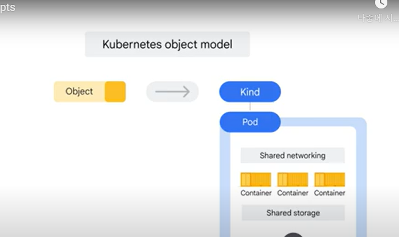

- pod는 container있는 환경을 구현하며 하나 이상의 container를 포함. container들은 서로 긴밀하게 연결, 네트워킹과 스토리지등 리소스를 공유
  
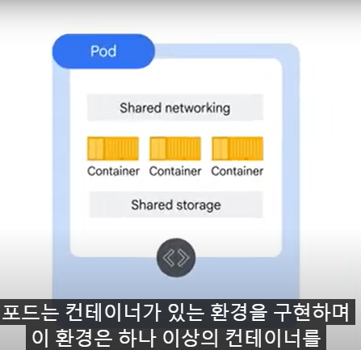

- pod는 유일한 주소를가지고, container는 ip주소와 port, network namespace등을 공유
- 같은 pod안의 container간에는 127.0.0.1(localhost)로 통신가능하며, 공유할 스토리지 볼륨집합도 지정 가능

#### **Kubernetes Component**

##### **Control Plane**
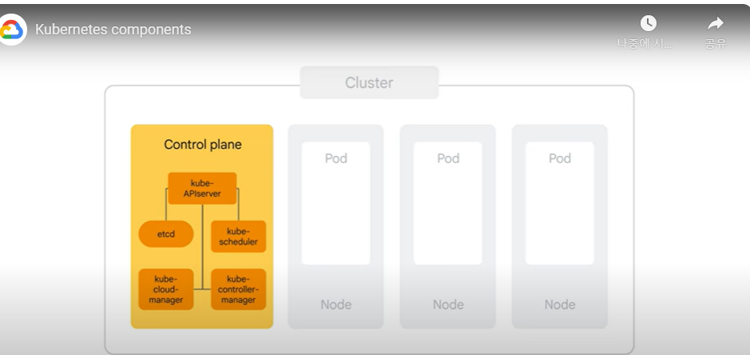

- 전체 클러스터를 조정
- **kube apiserver** 
  -  사용자가 직접 상호작용하는 유일한 구성요소. 
  -  클러스터의 상태를 보거나 변경하는 명령. pod 수행도 포함
  -  들어오는 요청을 인증하고 승인되고 유효한지 여부를 판별, admission을 제어
  -  실제로 클러스터 상태에 대한 모든 쿼리나 변경사항은 kube apiserver로 전달되어야함
- **kubectl** : kube apiserver에 연결하고 k8s api를 사용하여 통신
- **etcd** 
  - k8s cluster의 database
  - 안정적으로 k8s 상태를 저장
  - all the clutser configuration data
  - 어떤 node가 cluster의 부분인지
  - 실행해야할 pod 및 어디에서 실행되어야하는지
  - `하지만` 직접적으로 통신할일은 없음. api를 통해서 통신
- **kube scheduler** 
  - pod를 node에 스케줄링하는 역할
  - 각 개별의 pod의 requirement를 평가하고 어떤 node에 적할할지 평가
  - `하지만`  node에서 실제로 pod를 시작하는 작업은 수행 안함
  - 대신에 아직 할당된 node가 없는 pod 객체를 발견할때마다 node를 선택하고 해당 ndoe의 이름을 pod 객체에 쓴다
  - `scheduler가 어떻게 pod의 위치를 결정할까?`
    - 모든 node의 상태를 파악
    - hw,sw 및 정책 세부사항을 고려하여 pod가 실행될 수 있는 위치에대한 정의한 제약조거을 따름
    - `affinity parameter(친화성 매개변수)`도 정의 가능
    - `anti-affinity parameter(반친화성 매개변수)`도 정의 가능
- **kube controller** 
  - `kube apiserver`를 통하여 더 광범위한 작업을 수행 (클러스터의 상태를 지속적으로 모니터링)
  - 클러스터의 현재 상태가 원하는 상태와 일치하지 않을 때마다 원하는 상태를 달성하기 위해 변경을 시도
  - controller manager라고 부르는 이유는 많은 k8s 객체가 `controller`라는 `loops of code`로 유지관리 되기 때문 (수정 프로세스를 처리)
  - 특정 controller를 사용하여 workload 부하관리가 가능
  - 다른 종류의 controller는 시스템레벨의 역할을 가짐. ex) node controller는 node가 오프라인일때 모니터링하고 대응
- **kube cloud manager** 
  - 기본 cloud provider와 상호작용하는 controller를 관리
  - Compute engine에서 k8s를 수동으로 시작했다면, cloud manager는 Goolge Cloud 기능을 도입하는 역할(load balancer, storage volume)
- **pod와 workload의 차이점**
  - pod는 k8s에서 배포가능한 가장 작은단위 (하나이상의 container를 포함)
  - pod는 휘발성
  - pod안의 container들은 동일한 network namespace(ip 및 port 공유)와 저장소 볼륨을 공유
  - pod는 특정 작업을 실행하거나 컨테이너들을 그룹화하여 네트워크와 저장소를 공유하도록 구성할 때 사용됩니다.
  - workload는 애플리케이션을 실행하기 위한 작업부하를 추상적인 개념. pod를 생성하고 관리하는 고수준의 객체
  - **workload 종류**
    - **Deployment** : stateless 애플리케이션 사용
    - **StatefulSet** : 상태를 유지하는 애플리케이션 사용
    - **DaemonSet** : 각 node에서 반드시의 1개의 pod를 실행해야 할때 사용
    - **Job** : 단발성 작업을 실행할때 사용
    - **CronJob** : 주기적인 작업을 예약 실행할때 사용
    - **ReplicaSet** : 특정  pod의 복제본을 관리(보통 deployment에 의해 관리됨)
- workload는 pod를 생성하고 관리하는 역할
- workload는 pod 상태를 지속적으로 모니터링하고 실패한 pod를 자동으로 북구하거나 스케일링을 수행
- workload는 배포전략(Rolling Update,Canary Deployment)를 통해 애플리케이션의 업데이트를 곤리
  
- **node** 
  - pod를 실행
  - 각 node는 `kubelet`이라고 불리는 소규모의 control-plane 구성요소의 집합체
  - `kubelet`은 각 node의 agent
  - kube apiserver가 node에서 pod를 시작하려면 해당 node의 kubelet에 연결
  - container runtime을 사용하여 pod를 시작하고, 준비 및 활성 상태 probe를 포함한 pod의 수명주기를 모니터링 그리고 kube apiser에 보고
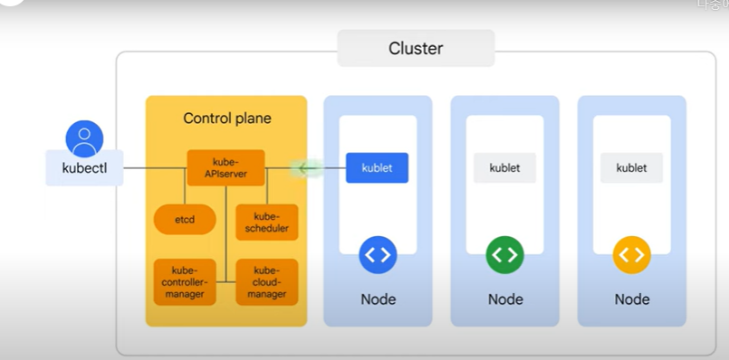

- **container runtime**
  - container 이미지에서 container를 시작하는 사용되는 sw
  - k8s는 여러 container runtime을 지원하지만, gke에서는 docker의 runtime 구성요소인 `containerd`를 사용하는 container를 시작

- **kube proxy**
  - 클러스터내 pod간의 네트워크 연결을 유지
  - oss k8s는 linux 커널에 내장된 `iptable`방화벽 기능을 사용하여 네트워크 연결을 구현
- 
##### **k8s와 gke의 차이점**
- gke는 control plane 구성요소를 곤리
- 모든 control plane 인프라를 provisioning 하고 관리할 책임이 있음
- 2가지 모드 
- **auto pilot** : node 구성, 자동확장, 자동 업그ㅔ이드, 기준 보안 구성 기존 네트워킹 구성과 같은 기본 인프라를 관리
- **장점**
  - production환경에 최적화
  - workload에 따라 기본 machine type을 설정
  - 강력한 보안상태
  - 운영 효율성을 높임
- **제한사항**
  - standard보다 구성옵션이 제한적
  - node affinity, host access도 제한 
  - node 객체에 대한 엑세스 제한 (no ssh, privilege escalation)
- **standard** : 개별 node를 구성하는 것을 포함하여 기본 인프라를 관리
- 클러스터 구성,관리,최적화에대한 책임이 사용자에게 있음

##### **Object management**
- 모든 object는 = unique name + identifier로 식별
- pod object는 어떻게 선언할까?

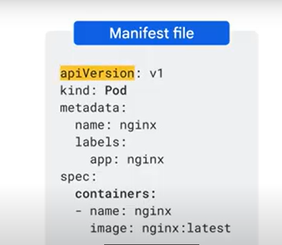
  - manifest파일에 선언 (yaml)
  - pod가 원하는 상태. 이름과 실행할 특정 컨테이너 이미지 정의
  - **apiVersion** : 객체 생성용 k8s api를 명시
  - **kind** : 원하는 객체의 종류. 위의 예에서는 pod
  - **metadata** : 객체 이름과, 고유ID와 선택적 namesapces를 식별하는 metadata
  - 모든 객체를 이름으로 식별 `name : nginx` (253자 미만의 고유한 문자열로 구성, 숫자,문자 하이픈,마침표를 사용)
  - 한 k8s namespaces에는 한 객체만 이름을 가질 수 있음
  - 객체는 label이 있음(key-value), 객체를 식별하고 구성하는데 유용
- 여러 객체가 있따면 관련객체를 `모두 같은 YAML`파일에 정의하는 것이 좋음  -> 관리의 변이성
- YAML파일을 `버전 제어 저장소`에 저장하는 것이 좋음 (변경사항을 쉽게 췾거하고 필요한 경우 변경사항을 실행 취소 하도록) `Cloud Source Repositories`
- k8s에서 컨테이너 관리하는 더나은 방법? `object controller`
- **object controller**
  - pod의 상테를 관리하는것
  - pod는 일회성이므로 스스로 복구되거나,수리지 되지않으며 영원히 실행되는것이 아님
  - Deployments,StatefulSet,StateLess,DaemonSet,Jobs 을 예로 등름
  - **Deployments** : web server와 같이 수명이 긴 SW구성요소를 관리할떄. 이를 그룹으로 관리하려는 경우 탁월한 선택
  - 아래 예에서는 3개의 pod를 모니터링하고 유지보수하는 역할을 함
  - kube-scheduler의 pod예약시 kube-apiserver에 알림 -> 배포 controller는 하위 객체인 ReplicaSet을 만들어 원하는 pod를  실행 -> 이 pod 중 하나에 장애가 발생하면 ReplicaSet controller에서 현재 상태와 원하는 상태의 차이를 인식하고 새pod를 실행하여 이를 해결 
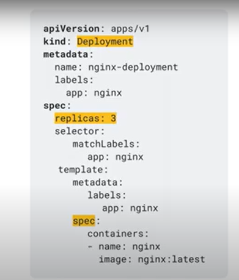
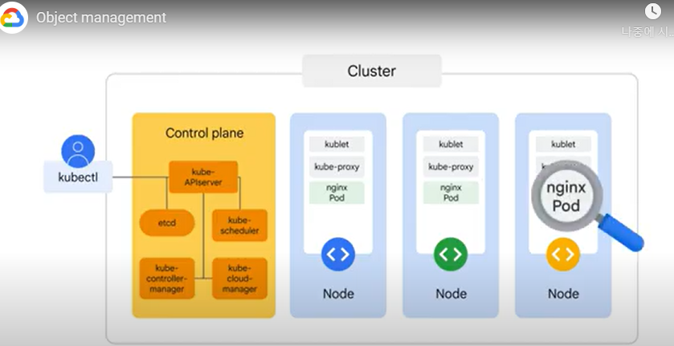

#### **Kubernetes Operations**

##### **kubectl**
- 관리자용 k8s cluster 제어 유틸리티
- control plane에서 kube api서버와 통신하는데 사용
- kubectl를 수행전 클러스터 위치  `location`과 `credentials`를 구성해야함
- `$HOME/.kube/config` 파일에 구성을 저장 
  - the list of clusters
  - the credentials that will be attached to each
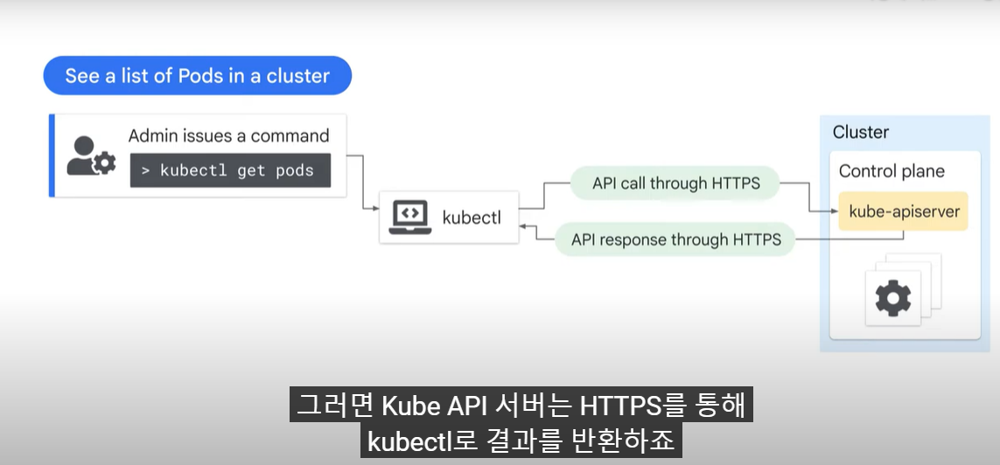
- 관리자가 kubectl 명령어 수행
- API호출로 변환하여 클러스터의 control-plane안의 `kube-apiserver` HTTPS를통해 전송
- `etcd`에 쿼리하여 요청을 처리 HTTPS로 다시 전송
- 마지막으로 API응답을 해석하고 명령 프롬프트에 뿌림

#### **syntax**
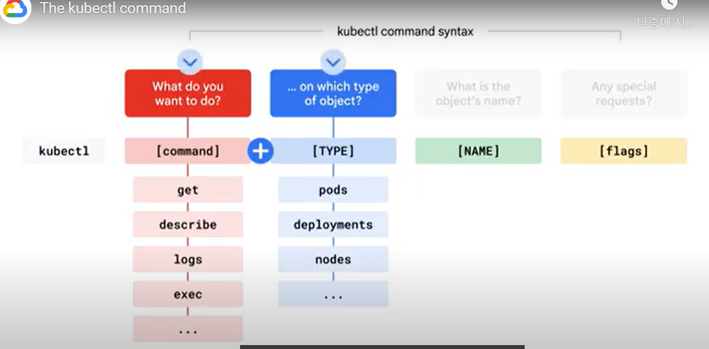
- creating,viewing, deleting k8s object
- viewing or exporting config files

##### **introspection**
- 애플리케이션 실행 시 문제를 debug하는 방법을 `instropection`
- cluster내 실행중인 정보를 수집하는 작업
- kubectl get 명령어로 pod 상태를 호가인하고 아래 상태들 중 한가지
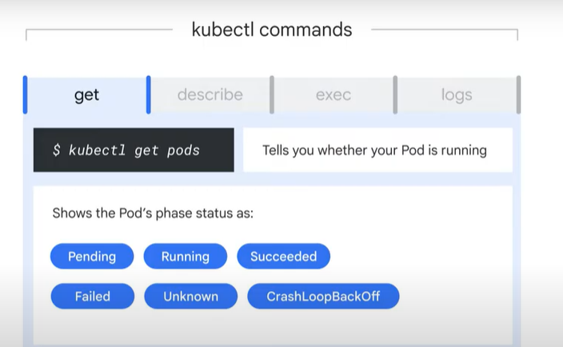- `pending` : 대기중, 저장소에서 이미지 가져올떄 컨테이너 이미지가 런타임에 아직 실행되지 않음
- `succeede` : pod가 성공적으로 종료. 다시 시작되지 않음 
- `failed` : pod가 container가 실패상태로 종료. 다시 시작되지 않음
- `unknown` : control plane과 kubelet간의 통신오류등으로 인해 상태를 검색할 수 없는 경우
- `crashloopbackoff` : pod의 container중 하나가 한번이상 다시 시작된 이후에도 예기치 않게 종료되었음(흔히 발생하는 오류, pod가 올바르게 구성되지않음)
- pod는 name,namespace,node name, labels, status, ip address가 표시 
- container는 state, images, ports, commands, restart counts등이 표시됨
-  `kubectl exec -it [pod name] --[command] `
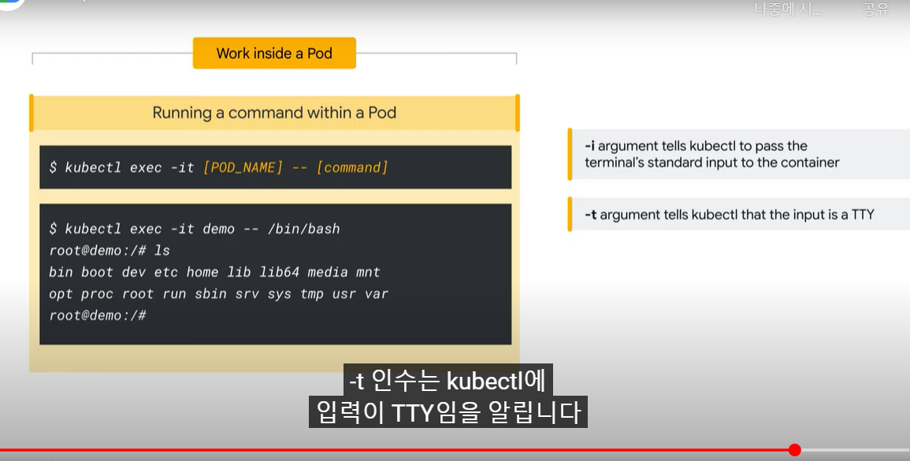

- 문제 해결을 위해 컨테이너 안에 sw를 설치하는 것은 옳지 않고 `컨테이너 이미지를 빌드`하는것이 좋다
- 대화형 셀을 활용해서 문제가 있는 변경해야 할 부분을 파악하고 이러한 변경을 컨테이너 이미지에 통합하고 다시 배포해야함
### 참고
- <https://www.cloudskillsboost.google/course_templates/2/video/517307>

