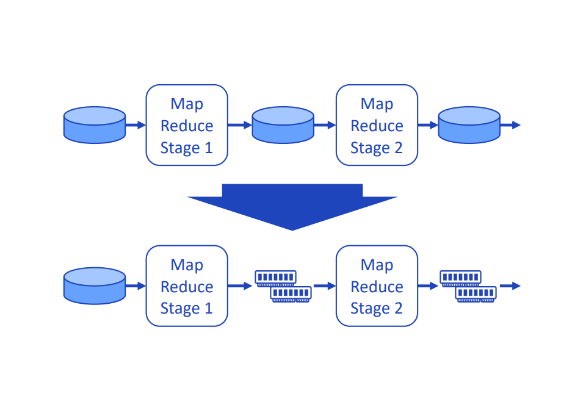
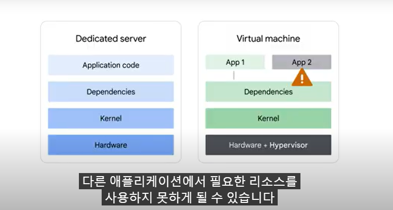
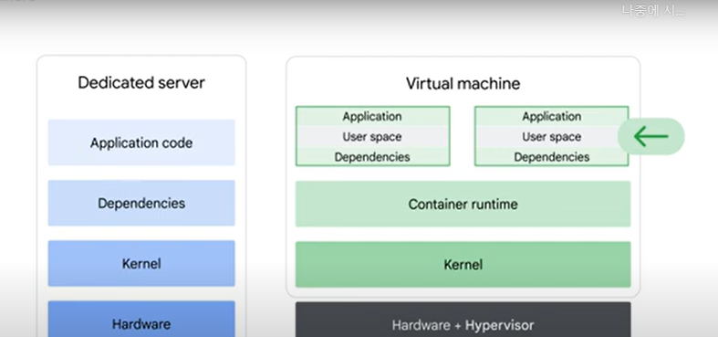
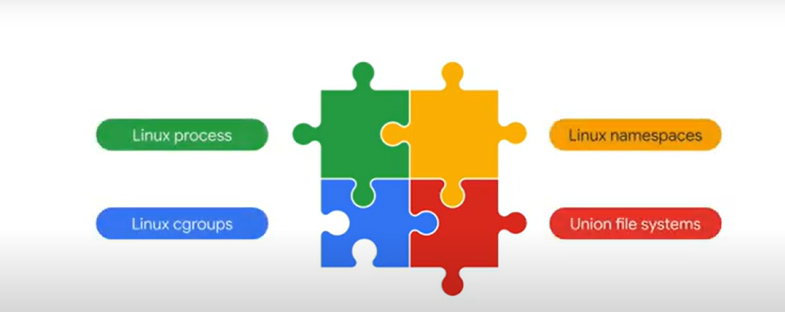
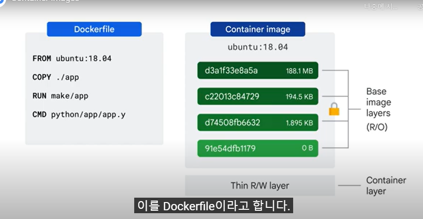

---
title: "(1) Getting Started with Google Kubernetes Engine"
date : 2025-01-13 09:00:00 +0900
categories: [Kubernetes,GKE]
tags : [gcp,wif]
---

### **Introduction to Containers and Kubernetes**

####  **Hypervisor** 
기본 하드웨어의 운영체제의 종속 항목을 타파하고 여러 가상머신에서 하드웨어를 공유할 수 있게 해주는 소프트웨어 레이어를 `하이퍼바이저`라고함 ex) KVM(커널 기반 가상머신)

- 가상화를 통해 새 서버를 상당히 빠르게 배포가능. 가상머신을 이미지호 하여 배포
- 리소스 낭비가 줄고 이동성이 향상
    

#### **한계** 
- 애플리케이션과 종속 항목(dependency) 운영체제로 여전히 묶여있음. VM을 다른 하이퍼바이저 제품으로 이전하는 것은 쉽지 않음
- 또한 단일 VM내에서 여러 애플리케이션을 실행하면 또 다른 문제가 발생
- 동일 종속항목 애플리케이션이 격리되지 않으며 한쪽이 리소스를 많이 사용하면 다른 애플리케이션에 영향을 줌
- 한쪽이 dependency를 업그레이드 하면 다른 애플리케이션이 멈출수도 있음
  
    
    
#### **Container**
위의 하이퍼바이저의 한계를 극복하고 커널이나 운영체제는 가상화할 필요 없이 사용자 공간(커널위의 모든 코드로 애플리케이션,dependency를 포함) 추상화를 구현한 것이 `Container`이다. 

- 애플리케이션 코드 실행을 위해 격리된 사용자 공간
- container가 가벼운 이유는 운영체제 전체를 포함하지 않기때문이다. 
- 기본 시스템에 예약하거나 긴밀하게 통합할 수 있어 효율적
- OS의 프로세스만 시작하고 중지하며 애플리케이션마다 VM전체를 부팅 할 필요가 없음
- 코드는 코드에 피룡한 모든 depedency와 함께 패키징 되며 container를 실행하는 엔진은 `runtime`에서 dependency를 사용할 수 있게 만드는 역할
  
- 확장 가능한 고성능 애플리케이션을 제공하는 코드 중심적인 방식
- container는 안정적인 hw와 sw에대한 엑세스를 제공
- linux 커널을 기반으로 하기때문에 코드가 local 또는 production에 잘 수행 
- 마이크로 서비스 설계 패턴, 즉 세분화되고 느슨하게 결합된 구성요소르 사용하여 쉽게 애플리케이션 빌드 가능

#### **Container Images**
- Container는 단순히 `image의 실행중인 instance일뿐`
- Container image에 sw를 build함으로써 개발자는 애플리케이션을 실행할 시스템에 대해 걱정하지 않고 애플리케이션을 패키징하여 제공 가능
- 하지만 Container image를 build하고 실행하려면 SW가 필요 ex) Docker는 image를 build하고 실행할 수 있지만 k8s와 같이 대규모 `application Orchestrate가 불가능 `
- Container는 작업 부하를 분리하는 기능을 가지고 있음. 아래와 같은 Linux 기술로 구현
  
    1. linux process :  다른 모든 프로세스와 별도로 자체 가상메모리 주소공간을 가지고 있음
    2. linux namespaces : 프로세스id, 디렉터리 트리, ip주소등 애플리케이션이 볼 수 있는 내용을 제어. k8s namespace와 다름
    3. linux cgroups : cpu, 시간, memory, i/o 대역폭 및 기타 리소스 최대 소비량등 애플리케이션이 사용할 수 있는 것을 제어
    4. union file systems : 필요한 모든것을 패키지로 묶음
- **Container manifest**

- dockerfile는 내부의 레이어를 지정. 읽기 전용이지만, 실행되면 쓰기 가능한 임시 최상위 레이어도 가지게됨
- 쓰기가능한 레이어는 일시적이므로 다른곳에 저장되어야함 
- 레이어마다 차이점만 해당 레이어에 저장 (전체 이미지 복사하는 대신)
- Google은 `Cloud Build`를 통하여 container를 제공(컨테이너 빌드관리)
- 해당 이미지를 GKE,APP Engine,Cloud Run등에 배포

### 참고
- <https://www.cloudskillsboost.google/course_templates/2/video/517307>
