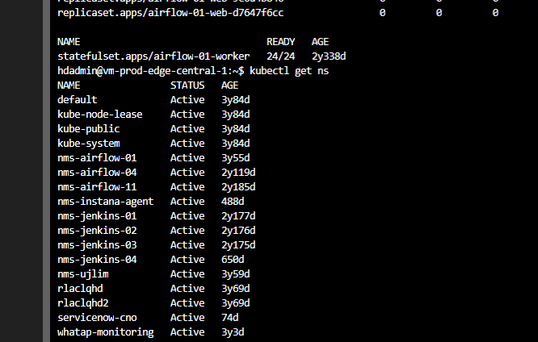

## Overview of kubectl
- kubectl은 k8s cluster를 제어하기 위한 cli(command line tool) 
- `kubectl`은 `$HOME/.kube` directory안에 `config`파일을 참조한다
- `KUBECONFIG` 환경변수를 setting함으로써 kubeconfig file 수정이 가능 (--kubeconfig  flag 사용)

---

## Syntax
`kubectl [command] [TYPE] [NAME] [flags]`
- `command` : resource에 수행할 operation 종류 
    - ex) create, get ,describe, delete

- `TYPE` : resource type의 종류를 명시 (case-sensitive, singular, plural, abrreviated 형태로 작성필요)
    ``` 
    kubectl get pod1 
    kubectl get pods pod1
    kubectl get po pod1
    ```
- `NAME` : 특정한 resource의 이름을 작성. case-sensitive(대소문자 구분) 이름이 생략시, 모든 resource의 detail이 display됨. `ex) kubectl get pods`
다수의 resource에 작동 시 , type그리고 name으로 특정 resource를 상세화 그리고 다수의 파일 기입 가능
    - `type 그리고 name`으로 resource를 지정방법
        - 같은 type이라면 resource들을 group화 
        > example : kubectl get pod ex-pod1 ex-pod2
        - 여러개의 다른 type의 resource들을 지정시
            - `TYPE1/NAME1 TYPE2/NAME`
        > kubectl get pod/ex-pod1 replicationcontroller/ex-rc1
    - `file`로 resource를 지정하는 방법
        - JSON보다 YAML을 사용하여 특정파일을 지정
        > kubectl get -f ./pod.yaml

--- 

## Operations


- api-resources : 가능한 API resource들을 리스트 
    > kubectl api-resources [flags]
- apply : file or stdin으로부터 configuration 변화를 resource에 적용
    > kubectl apply -f FILENAME [flags]
- attach : 실행중인 container에 연결 또는 상호작용
    > kubectl attach POD -c CONTAINER [-i] [-t] [flags]
- autoscale : replication controller에 의해 관리되는 pod들을 자동으로 scale 설정
    > kubectl autoscale (-f FILENAME | TYPE NMAE | TYPE/NAME) [ -- min=MINPODS ] -- max=MAXPODS --cpu-percent=CPU [flags]
- completion : Output Shell 자동완성
    > kubectl completion SHELL [options]
- config : kubconfig file을 수정
    > kubectl config SUBCOMMAND [flags]
- cordon : node를 unschedulable하게 지정
    > kubectl cordon NODE [options]
- cp : file 또는 directories들을 container로부터 복사
    > kubectl cp <src> <dest> [options]
- create : file또는 stdin으로부터 resource들을 생성
    > kubectl create -f FILENAME [flags]
- delete : file또는 stdin으로부터 resource들을 삭제(label selector, name, reousrce selector, resource 포함)
    > kubectl delete -f FILENAME 
- diff
- describe 
- drain
- edit
- exec
- explain
- expose
- get
- logs
- labels
- options
- patch
- run
- scale 
- set
- taint
- top

---

## Printing Containers log
- pod안의 container의 log를 프린트 하기위한 command
- log print
    > kubectl logs [pod-name]
- pod의 log를 streaming 
    > kubectl logs -f [pod-name]
    


#### **config**
- `kubectl config view`
- `kubectl config get-contexts`

#### `cluster info``
- `kubectl cluster-info`

#### `active context``
- `kubectl config current-context`

#### **Namespace 조회**
- `kubectl get ns`
  



#### **enable bash autocompletion for kubectl**
- `source <(kubectl completion bash)`


#### **What command can be used to identify which containers in a Pod are successfully running, and which are failing or having issues?**
- kubectl describe pod 


#### **Which command can be used to display error messages from containers in a Pod that are failing to run successfully?**
- kubectl logs 

### 참고
- [k8s공식doc](https://kubernetes.io/docs/reference/kubectl/overview/)