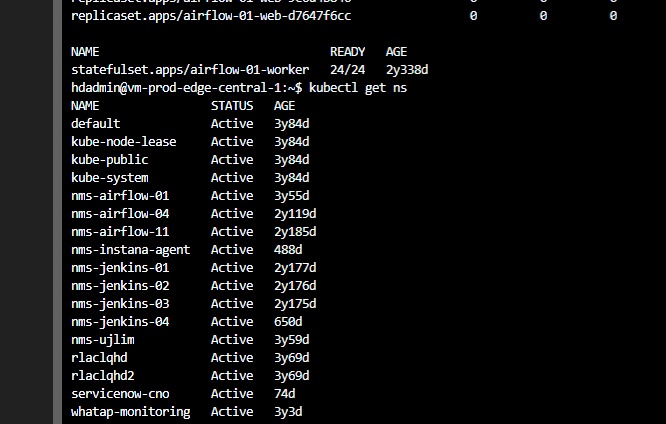

---
title: "(4) GKE interface with kubectl "
date : 2025-01-15 09:00:00 +0900
categories: [Kuberntest,GKE]
tags : [gcp,wif]
---

### **kubectl**

#### **config**
- `kubectl config view`
- `kubectl config get-contexts`

#### `cluster info``
- `kubectl cluster-info`

#### `active context``
- `kubectl config current-context`

#### **Namespace 조회**
- `kubectl get ns`
  

#### **enable bash autocompletion for kubectl**
- `source <(kubectl completion bash)`

#### **What command can be used to identify which containers in a Pod are successfully running, and which are failing or having issues?**
- kubectl describe pod 

#### **Which command can be used to display error messages from containers in a Pod that are failing to run successfully?**
- kubectl logs 
- 
### 참고 

