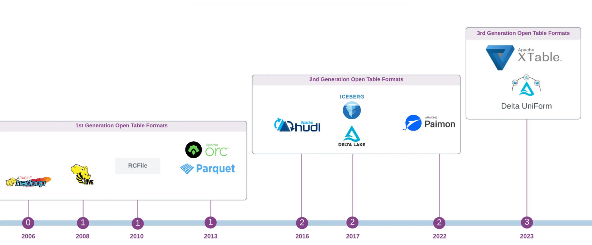

### **The History and Evolution of Open Table Formats**

### **The Origin of Table Formats**
- 현대판 database 개념은 `가 1970년에 발표한 Relation Model` 논문에서 영감을 받아 관계형 DB가 발명되면서 등장
- 그 이후로 `Table Format`은 선구적인 System R과 같은 관계형 DB관리시스템에서 구조화된 데이터를 관리하고 작업하기 위한 주요 `추상화 개념`이 되었음

### **Table Format Abstraction**

- **logical dataset** : 데이터 테이블은 디스크에 저장된 물리적 파일을 추상화한 계층으로, 통합된 2차원 표 형식뷰를 제공
- **storage engine**은 다양한 객체로부터 record들을 결합하여 dataset를 만들고 이를 하나 이상의 논리적 테이블로 최종사용자에게 표시
- 이러한 **logical table**은 애플리케이션과 사용자로부터 데이터의 물리적 특징을 숨길 수 있다는 장점을 제공

- 최근에 `open table format`에 대해 많이 들어봤는데 대단한것인지 혹은 `non-open`,`open` 그리고 `closed format`과의 차이점을 알아보자

### **Relational Table Format**

- 빅데이터 그리고 Apache Hadoop이 2000 중반에 나타나기전 **DBMS(Database Management Systems)`은 `monolithic architectural design**을 고수했음
- 이 architecture는 **tightly coupled, interconnected layers** 특징을 가지고 있음
- 각각의 layers는 database의 동작을 위한 특정한 functioon을 가지고 있음
- 구성요소들은 **single unified system**을 형성하기 위해 결합되었음
- storage layer는 특히 **data persistence**측면을 관리  
- 이 구조의 핵심은 **Storage Engine**. 이 구성요소는 가장 최하층의 추상화 레벨이고, 디스크의 데이터에 대한물리적 구성 및 관리를 감독

### **What's the implication?**

- 이 디자인은 **interoperability(상호 운용성)**이 부족
- DB파일을 다른 시스템에 복사하거나 python과 같은 일반언어를 사용하여 처리할 수 없음 
- 일반 쿼리엔진을 db의 os파일에 지정하여 데이터와 상호작용도 불가능

- 이러한 제약을 가만할때, 오늘날의 **OTF(Open Table Format)**같은 개념이 존재하지 않음 
- 기존 DB는 특정 구현과 긴밀하게 통합된 독점적인 저장 형식을 사용

### **Hadoop and Big Data Revolution**

- 1970년대부터 2006을 되돌아보면 **BIG Data Revolution**이 일어 났고 `Apache Hadoop project`가 Yahoo로부터 탄생하면서 db가 분해 [disassembly of database systems](https://materializedview.io/p/databases-are-falling-apart) 

- 주요한 architectural breakthrough(아키텍처 혁신)는 **the decoupling of storage and compute(스토리지와 컴퓨팅의 분리)**
- 이 아키텍처 변경으로 인해  HDFS 분산파일 시스템이 관리하는 **commodity hardware(저렴한 상용 하드웨어)**에서 **CSV,JSON,Avro 및 Parquet**과 같은 일반하된 semi-structured된 텍스트 기반 및 바이너리 형식으로 방대한 양의 데이터 저장이 가능 

-  데이터는 local file system에 저장되고, **분산 처리 framework MapReduce, Pig, Hive, Impala 그리고 Presto**과 같은 선택하여 처리 가능
-  이는 유연하지 않고 비싼 monolithic storage system과 독점 데이터웨어하우스에서 **game-changer**

- 그러나 진정한 혁신  [AMPLab co-director Michael Franklin](https://medium.com/s-c-a-l-e/database-guru-on-why-nosql-matters-and-sql-still-matters-c64239fe84fd)에서 언급한것 과같이 새로운 분리 아키텍처의 결과로 **data independence(데이터 독립성)** 
>
The real breakthrough was the seperation of the logical view you have of the data and how you want to work with if, from the physical reality of how the data is actually stored

- 그래서 당시에 **BigData wahs such Big Hype**
- 오늘날 **hype surrounds Generatvie AI**과 비슷한 레벨
- 그것은 그 뒤를 이은 **[open data ecosystems](https://practicaldataengineering.substack.com/p/open-source-data-engineering-landscape)**에 큰 영향을 줌

### **1st Generation OTF — The Birth of Open Table Format**

**Apache Hadoop**의 최초 릴리스는 데이터엔지니어에게 상당한 과제를 안겨줌

- **Java를 사용하여 MapReduce**로직에서 데이터 분석 및 처리 워크로드를 표헌하는 것은 복잡하고 시간이 많이 걸림
- 게다가 Hadoop에는 파일시스템의 데이터 세트에 대한 스키마를 저장하고 관리하는 메커니즘이 부족

- 이러한 격차를 줄이기 위해 초기의 영향 있는 Hadoop 채택자인  Facebook(현재 meta)는 **Hive프로젝트**를 시작
- 목표는 **기존 RDMBS에서 익숙한 SQL과 테이블 구조를 **Hadoop 및 HDFS 생태계** 도

- 주요한 차이점은 새로운 아키텍처적 접근 

> Being build on top of the decoupled physical layer, leveraing open data formats stored on HDFS distributed file system
> 

### **Impact of Apache Hive**
Facebook은 **2008년에 HIVE를 오픈소스화 시킴**. 몇년 후 **Cloudera**(저명한 Hadoop 벤더)가 **Impala**를 개발

**Apache Hive그리고 Impala가 Hadoop stack에 도입**되면서, **open file format기반의 the open table foramt개념이 등장**
directory기반 partitioning과 함꼐 Hive open table는 Hadoop 생태계 내에서 **data ingestion, data modeling, 그리고 managment**의 주요 추상화가 되었음

### **Evolution of Columnary Binary File Formats**
또 다른 중요한 발전은 **효율적인 columnar open file format**등장.
이것은 Apache Hive 프로젝트의  **1세대 columnar binary serialisation framework인  RCFiles**로부터 시작
  
이후의 혁신은 **2013년에 출시된 RCFile의 개량된 버전인 Apache ORC와 Twitter와 Cloudera의 공동작업으로 역시 2013년에 출시된 Apache parquet**이 있음
이러한 new open file foramt은 **Hadoop위의 OLAP기반의 workload의 성능을 획기적으로 향상시켜 데이터레이크 직접 OLAP저장 엔진을 구축할 수 있는 기반을 만듬**

그 이후 **ORC그리고 parquet**은 데이터에리크에서 저장된 데이터를 관리하는 데 있어서 **사실상 de facto(표준) open file format**되었으며
parquet이 더 인기를 얻고 생태계에서 더 폭 넓은 채택과 지원을 받음

다음은 Hive table format이 어떻게 구조화되었는지 상세하게 살펴하고 그전에 **Hive와 Impala가 사용하는 물리적 디자인을 일반화해보면.
이 디자인은 file system의 directory 계층구조에 크게 의존. 이를 **directory-oriented table format**이라고 부름

### **Directory-oriented Table Formats**
HDFS(데이터레이크)와 같은 분산 파일 시스템에서 데이터를 테이블로 처리하는 간단한 방법은 테이블을 디렉터리에 투사하는것
directory에는 data file 그리고 sub-directory(i.e partition)이 포함 

> The core principle is to organise data files in a **directory tree**. 
> In essence, a table is just a collection of files tracked at the directory level, 
> accessible by various tools and compute engine

여기서 중요한 요소는 이 아키텍처는 본질적으로 **tied to the physical file system layout** 데이터 관리를 위한 파일 및 디렉터리 작업에 의존. 
이는 hadoop이 시작된 이래로 데이터레이크에 데이터를 저장하는 표준 관행

### **What is the implication for Query Engines?**
테이블 파티션이 **sub-directory**로 표현되므로, query engine은 query planning 단계동안 적절한 data file을 식별하기 위해 하위 디렉터리로
표현된 각 파티션을 구문 분석하고 스캔하는 것은 쿼리엔진의 책임

물리적인 파티셔닝은 테이블 레벨에서의 논리적인 파티셔닝과 강력하게 결합되어 있음을 의미

### **Hive Table Format**
- Apache Hive가 directory-oriented table format이라고 말하는 것은 타당. 파일을 테이블과 파티션에 매핑 시키기 위해 **file system의 API**에 의존
결과적으로 Hive는 분산 파일 시스템 내의 데이터의 **물리적 레이아웃에 크게 영향을 받음**

- Hive는 field name과 value를 사용하여 파티션 디렉터리를 만드는 **own partitioning schema(자체 파티셔닝 체계)**를 사용
그것은 (**Metastore라고 불려진 RDMS에서** schema, partition 그리고 다른 metadata를 관리

- 지금까지 Hadoop+Hive의 중요한 변화는 다음과 같음

> 기존의 전통적인 일체형 DB와 달리, Hadoop과 Hive의 분리된 접근 방식은 
> 다른 쿼리 및 처리엔진이 **Hive 엔진의 metadata**를 사용하여 HDFS에서 동일한 데이터를 처리 할 수 있도록 함

- 이는 새로운 데이터 아키텍처와 기존 DBMS시스템간 또다른 주요한 차이점으로 이어짐
- 기존 시스템은 테이블 정의와 같은 **데이터와 metadata를 긴밀하게 결합하는 반면**, 새로운 paradigm은 이들은 불리 **This decoupling은 great flexibility를 제공**

- 게다가 **centralised schema registry(such as Hive metastore which has become the de facto standard)**를 사용하면 
**Spakr, Presto/Trino등 다른 processing engine**이  구조화된 표형식의 데이터와 상호 작용 가능

- registry내 테이블 metadata에 엑세스함으로써, query engine은 기본 storage 계층의 **파일 위치를 파악, 파티셔닝 체계를 이해하고, 자체적인 읽기와 쓰기 작업 수행가능**

### **Drawbacks and Limitations and the Directory-oriented and Hive table Format**

- 지난 10년동안 Hive는 Hadoop platform에서 가장인기 있는 테이블 형식으로 군림
- Uber,Facebook,Netflix과 같은 거대 기술 기업은 데이터를 관리하기 위해 Hive에 크게 의존
- 그러나 **데이터 플랫폼을 확장**하면서 Hive가 적절하게  해결할 수 없는 **&상당한 확장성 및 데이터 관리 문제에 직면**
- 이러한 기술 회사의 엔지니어들이 대안을 모색하게 된 계기가 된 directory-orientied table format 그리고 Hive style table의 단점 몇가지 살펴보자 
    - **High Dependency on Underlying File System**
      - 이 아키텍처는 atomicity(원시성),concurrency control(동시성 제어) 그리고 conflict resolution(충돌 해결)과 같은 필수적인 보장을 제공하기 위해 기본 storgae시스템에 크게 의존
      - aws s3의 atomic rename 없는것과 같이 이러한 속성이 없는 파일시스템 사용자 지정 해결방법이 필요
    - **File Listing Performance** 
      - directory 그리고 file listing operation이 성능 bottleneck현상이 될 수 있으며, 특히 대규모 쿼리 실행시 그렇다.
      - aws s3와 같은 Cloud Object는 directory style listing operation에 상당한 제약을 가한다(ex operation당 1000개의 object s3 list 제한)
    - **Query Planning Overhaed**
      - HDFS와 같은 분산 파일시스템에서 전체 file 및 partition 목록이 필요하기때문에 query plan에 많은 시간이 소요

### **Drawbacks and challenges of using Hive-style partitioning:**
- **Over Partitioning**
  - 물리적 그리고 논리적 partitioning 밀접하게 결합하면 over-partitioning을 유발
  - 특히 카디널리티가 높은 파티션 컬럼 경우 `year/month/day` 경우 그럴 수 있음 (** 카디날리티가 높다 = 고유한 값이 많다)
  - 이로 인해 `지나치게 작은 파일, metadata overhaed 증가 그리고 수많은 파티션을 스캔`해야 하기 때문에  **query planning(쿼리계획)이 느려짐**
- **Cloud Effect**
  - Cloud data lake는 `API 호출 제한`으로 인해 over partitioning이슈를 악화시킴
  - partition과 file 스캔 Job은 **throttling**을 만나 심각한 performance degradation(성능저하)으로 이어짐
- **Poor Performance**
  - directory 기반의 partition의 query는 **특정한 partition key를 지정하지 않으면, 느리다(특히 파티션 계층이 깊을떄)** 

하이브 테이블이 20개의 주로 분할되고 `year=/month=/day=/hour=` 파티션으로 분할된다고 가정하자. 6년동 100만개이상의 파티션을 축적함

### **Drawbacks of using External Metastore**
- 위의 단점  외에도 **external metastore**를 사용하는 Hive 스타일 테이블은 더 많은 challenge를 추가함
- **Performance Bottleneck**
  - Hive와 Impala는 모두 external metastore(일반적으로 MySQL이나 PostgreSQL와 같은 RDBMS)에 의존하는데 이는 테이블작업을 위한 번번한 communication으로 **performance bottleneck**야기
- **Metadata Performance Scalability**
  - data volumne과 partition 증가롱 ㅣㄴ해, metastore가 점점 더 많은 부담을 가지게되고, **slow query planning, increased load 그리고 potential of out of memory**에러 발생
- **Signle Point of Failure**
  - metastore는 단일 장애이점을 나타냄. creash 또는 unavailability는 광범위한 쿼리 실패를 일으킴
- **Inefficient Statistics Management**
  - partition level의 column 통계에 대한 hive의 의존성은 시간이 지남에 따라 성능을 저해 가능
  - 수 많은 column과 partition이 있는 넓은 테이블은 방대한 양의 통계 데이터를 축적하여 query planning을 느리게 하고 DDL command에 영향을 준다

### **A First-hand Experience**

### **참고**

- <https://alirezasadeghi1.medium.com/the-history-and-evolution-of-open-table-formats-0f1b9ea10e1e>
- <https://practicaldataengineering.substack.com/p/the-history-and-evolution-of-open?utm_source=publication-search>
- <https://practicaldataengineering.substack.com/p/the-history-and-evolution-of-open-14d?r=23jwn&utm_campaign=post&utm_medium=web&triedRedirect=true>
